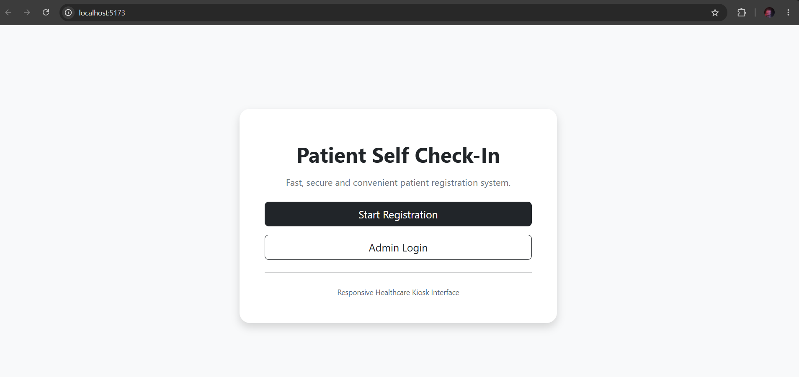
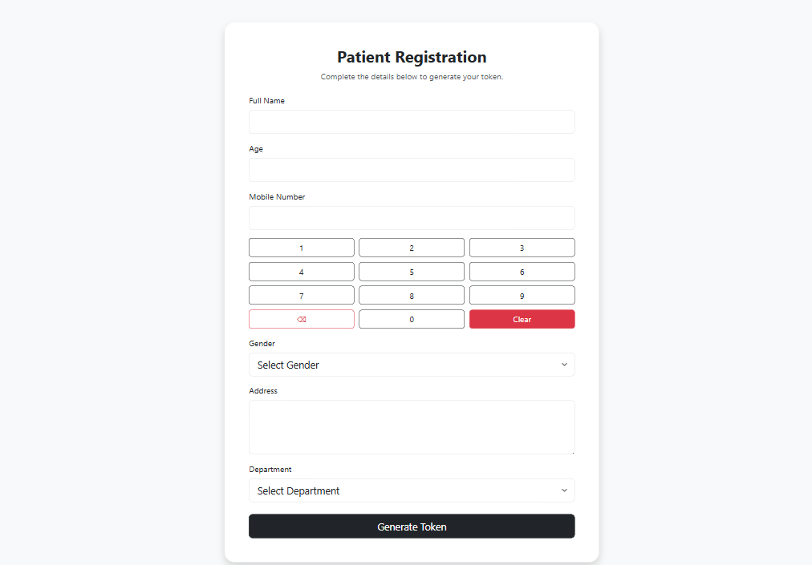
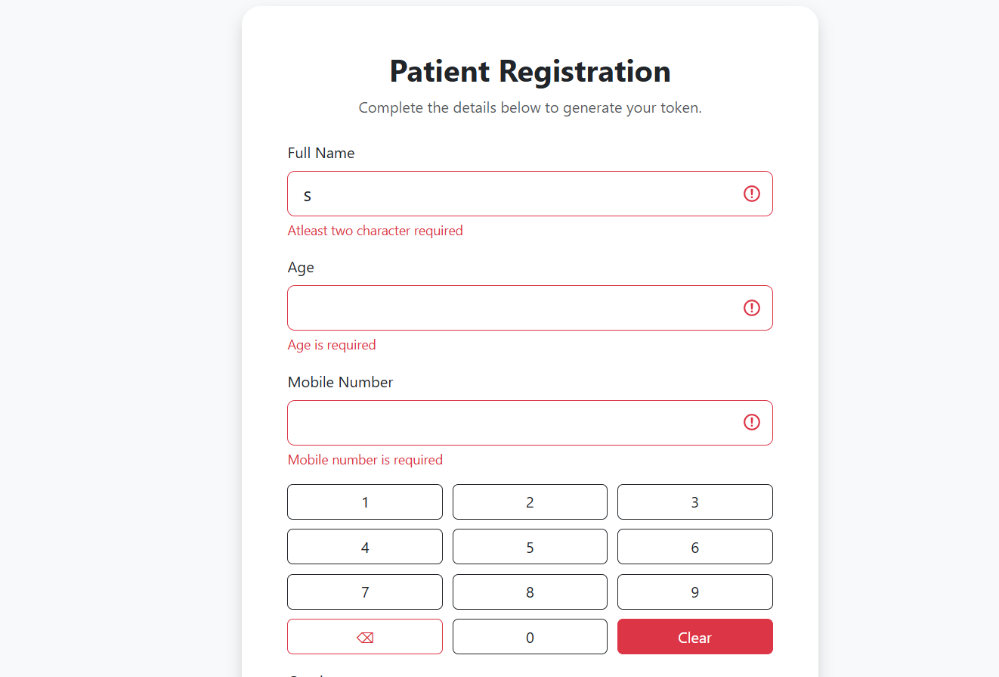
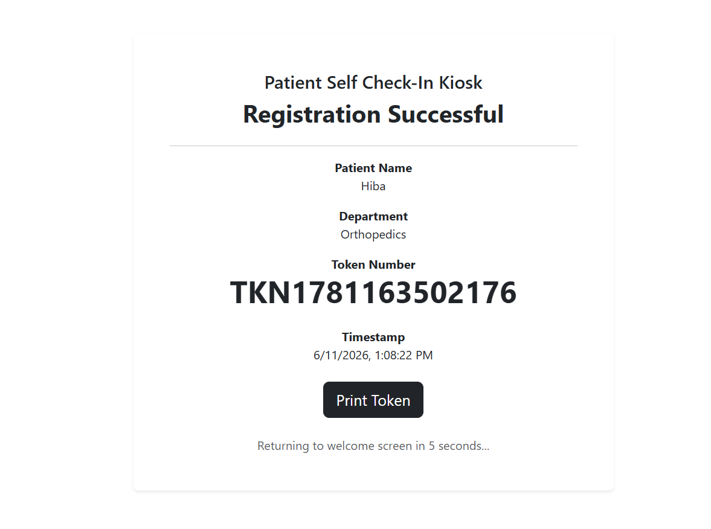
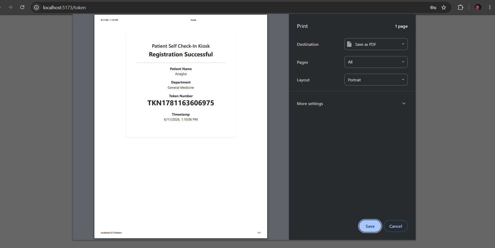
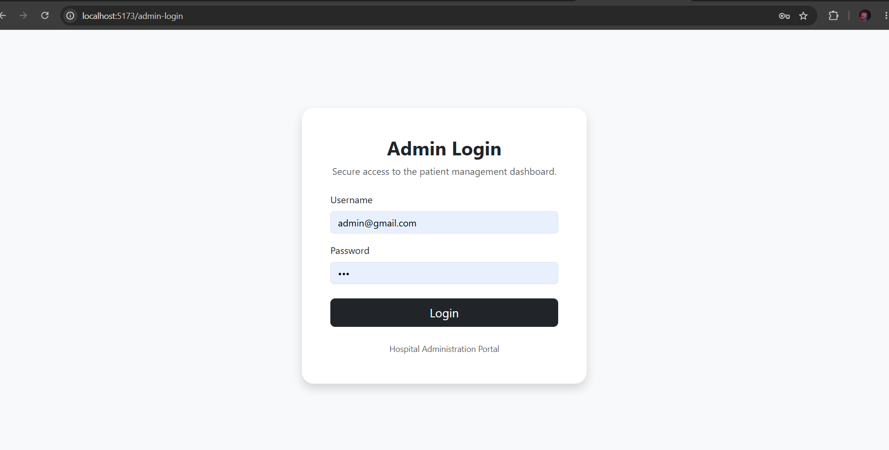
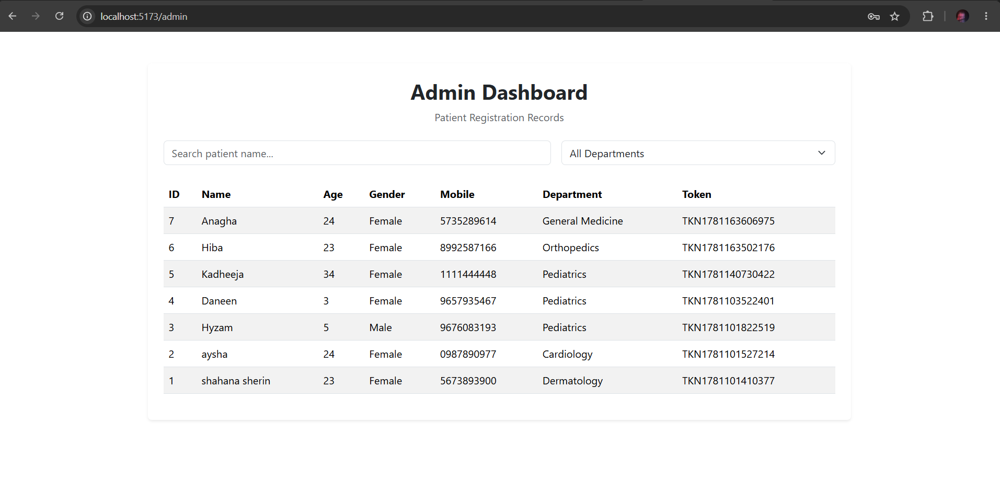
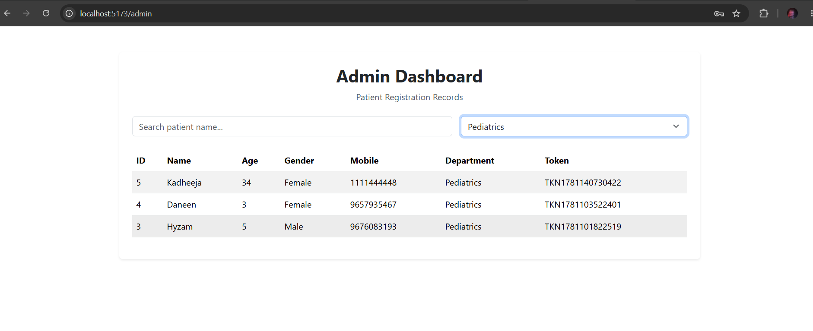
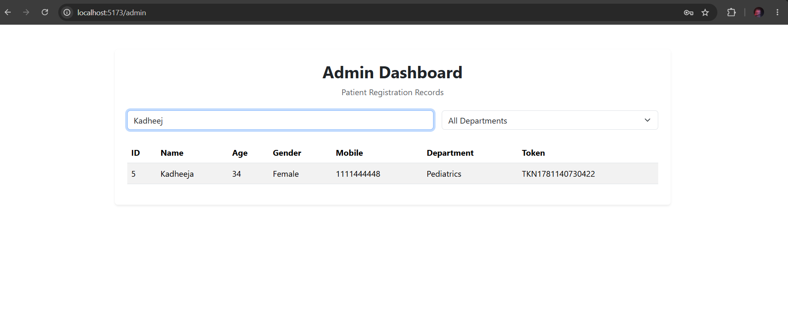

#  Patient Self Check-in Kiosk System

A full-stack **Patient Self Check-in Kiosk Application** built for healthcare facilities.

The system allows patients to self-register, generate tokens, and enables administrators to manage patient records efficiently through a responsive kiosk-friendly interface.

---

#  Features

##  Patient Module

* Patient self-registration form
* Responsive kiosk-friendly interface
* Form validation using Formik and Yup
* Automatic token generation
* Token confirmation screen
* Print token functionality
* Auto redirect after successful registration
* Loading indicators during API calls

---

## Admin Module

* Admin login page
* View all patient registrations
* Search patients by name
* Filter patients by department
* View generated token numbers
* Responsive dashboard layout

> Note: The admin login uses simple credential validation for demonstration purposes.


---

#  Tech Stack

## Frontend

* React.js
* React Router DOM
* Axios
* React Bootstrap
* Formik
* Yup

## Backend

* Node.js
* Express.js
* SQLite3
* CORS
* dotenv

---

#  Project Structure

```text
PATIENT-SELF-CHECKIN-KIOSK
│
├── backend
│   ├── controllers
│   │   └── patientController.js
│   │
│   ├── database
│   │   ├── db.js
│   │   └── patient.db
│   │
│   ├── middleware
│   │   └── validation.js
│   │
│   ├── models
│   │   └── patientModel.js
│   │
│   ├── routes
│   │   └── patientRoutes.js
│   │
│   ├── .env
│   ├── package.json
│   └── server.js
│
├── frontend
│   ├── pages
│   │   ├── Welcome.jsx
│   │   ├── Register.jsx
│   │   ├── Token.jsx
│   │   ├── AdminLogin.jsx
│   │   └── AdminDashboard.jsx
│   │
│   ├── services
│   │   └── patientApi.js
│   │
│   ├── public
│   │
│   ├── src
│   │   ├── assets
│   │   ├── styles
│   │   ├── App.jsx
│   │   └── main.jsx
│   │
│   ├── package.json
│   └── vite.config.js
│
├── screenshots
│
└── README.md
```

---

#  Environment Setup

## 1. Clone Repository

```bash
git clone https://github.com/ShahanaNazer12/Patient-Self-Checkin-Kiosk.git
cd patient-self-checkin-kiosk
```

---

## 2. Backend Setup

```bash
cd backend
npm install
```

Create a `.env` file:

```env
PORT=5000
```

Start backend server:

```bash
npm run dev
```

Server runs on:

```text
http://localhost:5000
```

---

## 3. Frontend Setup

```bash
cd frontend
npm install
npm run dev
```

Frontend runs on:

```text
http://localhost:5173
```

---

#  API Endpoints

## Patient APIs

### Create Patient

```http
POST /api/patients
```

### Get All Patients

```http
GET /api/patients
```

### Get Patient By ID

```http
GET /api/patients/:id
```

### Search Patients

```http
GET /api/patients?search=name
```

### Filter Patients By Department

```http
GET /api/patients?department=department
```

---

#  Database Schema

## patients

| Field      | Type     |
| ---------- | -------- |
| id         | INTEGER  |
| name       | TEXT     |
| age        | INTEGER  |
| gender     | TEXT     |
| mobile     | TEXT     |
| address    | TEXT     |
| department | TEXT     |
| token      | TEXT     |
| created_at | DATETIME |

---

#  Assessment Requirements Covered

✅ Responsive Desktop Layout

✅ Responsive Tablet/Kiosk Layout

✅ Healthcare-themed User Interface

✅ Inline Validation Messages

✅ Loading Indicators for API Calls

✅ Token Generation

✅ Token Printing

✅ Search Functionality

✅ Department Filtering

✅ SQLite Database Integration

✅ REST API Architecture

---

#  Operational Proof

## Welcome Screen



## Registration Page



## Validation Messages



## Token Screen



## Print Token Preview



## Admin Login



## Admin Dashboard



## Filter By Department



## Filter By Name



---

#  Author

Developed as part of a Full Stack Developer Assessment.

Frontend: React.js + React Bootstrap

Backend: Node.js + Express.js

Database: SQLite3
